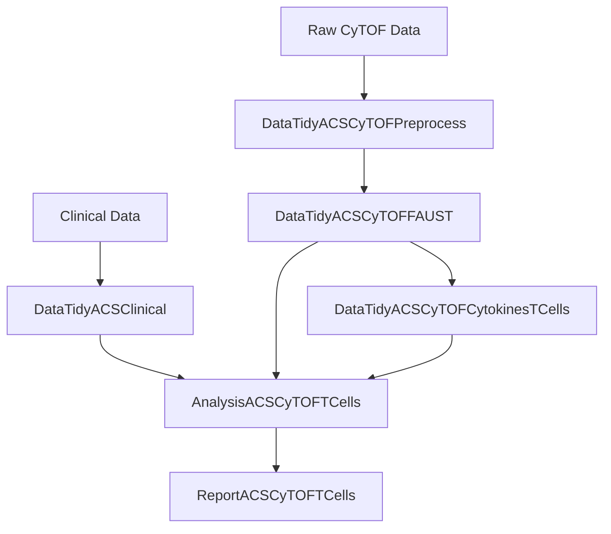

# Compendium of ACS CyTOF T Cells

## Repository structure and how to obtain the project code

This repository acts as a **compendium and entry point** for the ACS CyTOF T cell analysis.
It does not itself contain all analysis code.
Instead, it coordinates a collection of repositories that together implement the full data processing, analysis, and reporting workflow.

The canonical list of required repositories, including the specific branches used for each analysis, is defined in `repos.list`.

### Cloning this repository

First, clone this repository in the usual way:

```bash
git clone https://github.com/SATVILab/CompACSCyTOFTCells.git
cd CompACSCyTOFTCells
```

This repository should be treated as the **anchor directory** for the project. All other project repositories will be cloned **alongside it**, not inside it.

### Cloning all required project repositories

All required repositories and their corresponding branches are specified in `repos.list`. This file defines:

* Which repositories are needed
* Which branch of each repository should be used
* The directory name each repository should be cloned into

A setup script is provided to clone all repositories exactly as specified.

#### Running the setup script

From within the `CompACSCyTOFTCells` directory, run:

```bash
scripts/setup-repos.sh
```

Important behaviour to note:

* Repositories are cloned **one directory level above** `CompACSCyTOFTCells`
* For example, if your directory layout is:

  ```
  ProjectACSCyTOFTCells/
    ├─ CompACSCyTOFTCells/
  ```

  then after running the script you will have:

  ```
  ProjectACSCyTOFTCells/
    ├─ CompACSCyTOFTCells/
    ├─ DataTidyACSCyTOFFAUST/
    ├─ AnalysisACSCyTOFTCells/
    ├─ ReportACSCyTOFTCells/
    └─ ...
  ```

This layout is intentional and is assumed by the VS Code workspaces provided in this repository.

The script is compatible with:

* macOS and Linux
* Git Bash on Windows
* Bash 3.2 and later

The only requirement is that Git is installed and available on the command line.

---

## Overview of project repositories

Below is a high-level description of the main repositories used in the ACS CyTOF T cell project, grouped by function.

### Data tidying and preprocessing

**DataTidyACSClinical**

Processes clinical metadata, including TB-related clinical variables.

**DataTidyACSCyTOFPreprocess**

Handles preprocessing of raw CyTOF data, from instrument output through to live, DNA-positive, singlet cells.

**DataTidyACSCyTOFFAUST**

Runs FAUST on preprocessed CyTOF data.
This repository is used in two branches:

* `primary`: the original FAUST run used for the main analysis
* `flowsom`: a later FAUST run used for FlowSOM-based analyses. It has identical parameters to the `primary` run, but was re-run to re-generate FCS files of FAUST-annotated cells for FlowSOM input.

The FAUST output provides:

* FAUST counts for downstream statistical modelling
* Cell-level annotations, including lineage labels such as CD4, CD8, and γδ T cells, as well as associated FCS files
* Detailed FAUST phenotypes used in later analyses

### Cytokine data processing

**PipelineDataACSCytokines**

Contains shared functions used to process cytokine data.

**DataTidyACSCyTOFCytokinesTCells**

Applies the `StimGate` algorithm to classify cytokine-positive cells.
This is done separately for:

* CD4 T cells
* CD8 T cells
* γδ T cells

Both `primary` and `flowsom` branches are used, corresponding to the FAUST runs described above.
Outputs include cytokine-positive cell counts at both lineage and detailed phenotype levels, as well as FCS files of cytokine-positive cells for each lineage.

### Analysis

**PipelineAnalysisACS**

Provides reusable analysis functions used across modelling and downstream analyses.

**AnalysisACSCyTOFTCells**

Implements the statistical analyses and model fitting for the project.
This repository has:

* `primary` branch for the main analysis
* `flowsom` branch for FlowSOM-based analyses

### Reporting

**ReportACSCyTOFTCells**

Generates figures and tables used in the publication.
Again, both `primary` and `flowsom` branches are provided, corresponding to the respective analyses.

### Legacy and unused repositories

Some repositories may appear in the organisation but are not part of the current analysis workflow, including:

* Older versions of the stimgate package
* Experimental or deprecated cytokine storage repositories

These are not required for reproducing the analyses described here.



---

## 📂 Obtaining Raw Data

This compendium coordinates the *code* required for the analysis. However, the **raw data** (such as FCS files, clinical metadata, and intermediate datasets) is not stored in this repository due to size and privacy constraints.

Each individual repository contains specific instructions on how to obtain the input data required for its part of the pipeline.

*   **Clinical Data:** See the `README` in **DataTidyACSClinical**.
*   **Raw CyTOF Files:** See the `README` in **DataTidyACSCyTOFPreprocess**.
*   **Intermediate Objects:** Downstream repositories (like `AnalysisACSCyTOFTCells`) may require processed objects from upstream steps. These dependencies are documented in their respective `README` files.

Please consult the documentation within each specific sub-repository for access instructions and download links.

---

## Working with the project in VS Code

This repository provides VS Code workspace files (`.code-workspace`) that open multiple repositories at once in a single, multi-root workspace.

The most relevant workspaces are:

* **Primary**
  Includes only the repositories and branches used for the main analysis.

* **FlowSOM **
  Includes only the repositories and branches used for the FlowSOM-based analysis.

* **EntireProject**
  Includes all repositories cloned via `repos.list`.

These workspaces assume the directory structure created by `scripts/setup-repos.sh`.

---

## Reproducible execution using the project container

A pre-built container image is provided to ensure a fully reproducible execution environment for all data processing, analysis, and reporting steps.

The image is available from GitHub Container Registry:

```bash
docker pull ghcr.io/satvilab/compacscytoftcells:latest
```

The container definition is given in `.devcontainer/devcontainer.json`. It provides a consistent Linux environment with all system dependencies required to run the R code in this project.

All data-processing, analysis, and reporting repositories use `renv` for R package management.
The container image includes a populated `renv` cache containing the R packages required by these repositories, which substantially reduces installation time and ensures consistency across machines.

### Recommended ways to use the container

In practice, there are two recommended ways to work with the project using this container.

### Option A: VS Code devcontainer (recommended for local development)

This is the simplest approach for most users.

1. Clone the `CompACSCyTOFTCells` repository and set up the project repositories as described above.
2. Open the `CompACSCyTOFTCells` repository in VS Code.
3. When prompted, choose **“Open this repository in a devcontainer”**.

VS Code will automatically pull the container image and start a development environment inside it. All cloned repositories can then be accessed within the container, and R sessions will use the preconfigured `renv` cache.

This approach requires Docker to be installed locally, but does not require any manual Docker commands.
To install Docker locally, follow the instructions for your operating system.
It is straightforward for Linux and macOS, whilst Windows users will need to first setup Windows Subsystem for Linux (WSL2) before installing Docker Desktop.

### Option B: Apptainer on HPC systems (recommended for running FAUST)

On high-performance computing systems, Docker is often not available for security reasons.
In these cases, the same container can be used via Apptainer (formerly Singularity).

First, pull the container image and convert it to a `.sif` file:

```bash
apptainer pull sif/compacscytoftcells.sif \
  docker://ghcr.io/satvilab/compacscytoftcells:latest
```

It is recommended to store the image in a dedicated directory such as `sif/`, as many HPC systems impose quotas or policies on home directories.

You can then run commands inside the container using:

```bash
apptainer run sif/compacscytoftcells.sif
```

This allows the full analysis pipeline to be executed in the same reproducible environment as the devcontainer, without requiring Docker.

---

## 📄 Citation

Please cite both the **Scientific Paper** (for the biological findings) and the **Software** (if you used this specific code).

### 1. Cite the Scientific Paper

If you use the methodology or biological findings from this work, please cite the accompanying publication:

> **Rozot V, Rodo MJ, Young C, Musvosvi M, et al.** "[Insert Full Paper Title Here]." *[Journal Name]* (202x). DOI: [Insert DOI]

### 2. Cite this Software

If you use this specific software implementation in your analysis, please cite:

> **Rodo MJ & Scriba TJ.** (2026). *CompACSCyTOFTCells* [Computer software]. Version 1.0.0. SATVI, University of Cape Town.

### BibTeX

```bibtex
@article{rozot_rodo_2026,
  title = {[Insert Full Paper Title Here]},
  author = {Rozot, Virginie and Rodo, Miguel J and Young, Carly and Musvosvi, Munyaradzi and others},
  journal = {[Journal Name]},
  year = {2026},
  doi = {[Insert DOI]}
}

@software{rodo_scriba_2026,
  author = {Rodo, Miguel J and Scriba, Thomas J},
  title = {CompACSCyTOFTCells},
  year = {2026},
  publisher = {SATVI, University of Cape Town},
  version = {1.0.0},
  url = {https://github.com/SATVILab/CompACSCyTOFTCells}
}
```

## License

This code is licensed under the Apache version 2.0 license to the University of Cape Town. See the [LICENSE](LICENSE) file for details.